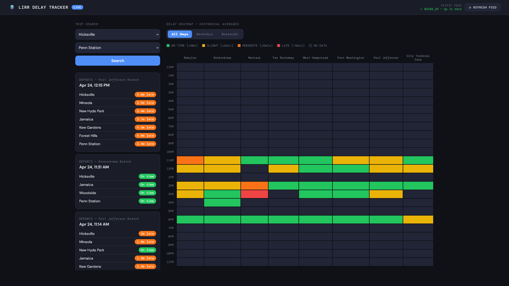

# 🚆 LIRR Delay Tracker

A full-stack real-time delay tracking and historical analytics dashboard for the Long Island Rail Road, built with React, Node.js, and PostgreSQL.



**[Live Demo](https://mta-tracker-client.onrender.com)** — deployed on Render

---

## Features

- **Real-time trip search** — searchable station dropdowns to find any origin/destination pair, showing upcoming trips with per-stop delay status and route names
- **Live delay badges** — per-stop status indicators (On time / X min late / No data) color-coded green, orange, and red
- **Delay heatmap** — historical average delays by route and hour of day, filterable by All Days, Weekdays, or Weekends
- **GTFS feed management** — header displays current static feed version with up-to-date status, and a one-click refresh button to download and reimport the latest MTA schedule
- **Automatic data pipeline** — backend polls the MTA GTFS Realtime feed every 5 minutes, calculates delays against the static schedule, and persists results to PostgreSQL
- **Historical accumulation** — heatmap stats are aggregated over time and never wiped, improving accuracy the longer the app runs
- **Smart schedule management** — static GTFS schedule only reimports when the MTA publishes a new feed version
- **Auto GTFS download** — on first startup the server automatically downloads and extracts the static GTFS zip if not present

---

## Tech Stack

**Frontend**
- React (Vite)
- DM Sans + DM Mono (Google Fonts)
- Vanilla CSS with CSS variables for dark theme

**Backend**
- Node.js + Express
- MTA GTFS Realtime feed via `gtfs-realtime-bindings`
- Static GTFS schedule parsed via `csv-parser`
- `adm-zip` for zip extraction
- `node-fetch` for HTTP requests
- Supabase (PostgreSQL) via `@supabase/supabase-js`

**Infrastructure**
- Backend hosted on Render (Web Service)
- Frontend hosted on Render (Static Site)
- Database hosted on Supabase

---

## Architecture

```
┌─────────────────────────────────────────────────┐
│                  React Client                   │
│  Trip Search │ Delay Badges │ Heatmap │ GTFS UI │
└──────────────────┬──────────────────────────────┘
                   │ REST API
┌──────────────────▼──────────────────────────────┐
│              Express Server                     │
│  /api/trips  /api/heatmap  /api/stopnames       │
│  /api/routenames  /api/gtfs/status+refresh      │
└──────────────────┬──────────────────────────────┘
                   │
       ┌───────────┴───────────┐
       │                       │
┌──────▼──────┐       ┌────────▼────────┐
│  MTA GTFS   │       │    Supabase     │
│  Live Feed  │       │   PostgreSQL    │
│ (Realtime)  │       │                 │
└─────────────┘       │  trip_updates   │
                      │  scheduled_times│
┌─────────────┐       │  heatmap_stats  │
│  MTA GTFS   │       │  stops          │
│  Static ZIP │       │  routes         │
│ (Schedule)  │       │  feed_metadata  │
└─────────────┘       └─────────────────┘
```

---

## How Delay Calculation Works

1. The server fetches the MTA GTFS Realtime feed every 5 minutes
2. Each stop's real-time arrival (Unix timestamp) is converted to Eastern time
3. The scheduled arrival for that `trip_id` + `stop_id` is looked up from the static GTFS schedule
4. `delay_seconds = real_arrival_seconds - scheduled_arrival_seconds`
5. Results are upserted into `trip_updates` and aggregated into `heatmap_stats`
6. `heatmap_stats` tracks `total_delay_seconds`, `sample_count`, and `day_type` (weekday/weekend) per route per hour, enabling accurate historical averages over time

---

## Getting Started

### Prerequisites

- Node.js 18+
- A free [Supabase](https://supabase.com) account

### Installation

```bash
# Clone the repo
git clone https://github.com/your-username/mta-project.git
cd mta-project

# Install server dependencies
cd server
npm install

# Install client dependencies
cd ../client
npm install
```

### Configuration

Create a `.env` file in `/server`:

```
SUPABASE_URL=https://your-project.supabase.co
SUPABASE_KEY=your-anon-public-key
PORT=5170
```

Create a `.env` file in `/client`:

```
VITE_API_URL=http://localhost:5170
```

### Database Setup

Run the following in your Supabase SQL Editor:

```sql
CREATE TABLE trip_updates (
  id SERIAL PRIMARY KEY,
  trip_id TEXT,
  route_id TEXT,
  stop_id TEXT,
  arrival BIGINT,
  departure BIGINT,
  schedule_relationship INT,
  delay_seconds INT,
  updated_at TIMESTAMP,
  CONSTRAINT unique_trip_stop UNIQUE (trip_id, stop_id)
);

CREATE TABLE scheduled_times (
  trip_id TEXT,
  stop_id TEXT,
  scheduled_arrival TEXT,
  PRIMARY KEY (trip_id, stop_id)
);

CREATE TABLE stops (
  stop_id TEXT PRIMARY KEY,
  stop_name TEXT,
  stop_lat FLOAT,
  stop_lon FLOAT
);

CREATE TABLE routes (
  route_id TEXT PRIMARY KEY,
  route_short_name TEXT,
  route_long_name TEXT
);

CREATE TABLE heatmap_stats (
  route_id TEXT,
  hour INT,
  day_type TEXT DEFAULT 'weekday',
  total_delay_seconds BIGINT DEFAULT 0,
  sample_count INT DEFAULT 0,
  PRIMARY KEY (route_id, hour, day_type)
);

CREATE TABLE feed_metadata (
  id SERIAL PRIMARY KEY,
  feed_version TEXT,
  imported_at TIMESTAMP DEFAULT NOW()
);

CREATE OR REPLACE FUNCTION truncate_scheduled_times()
RETURNS void AS $$
  TRUNCATE TABLE scheduled_times;
$$ LANGUAGE sql;
```

### Running the App

```bash
# Start the backend (from /server)
node index.js

# Start the frontend (from /client)
npm run dev
```

The app will be available at `http://localhost:5173`. On first startup the server automatically downloads the MTA GTFS static zip, imports stops, routes, and the schedule, then begins polling the live feed every 5 minutes.

---

## Project Structure

```
mta-project/
├── gtfs/                          # MTA static GTFS files (auto-downloaded)
├── server/
│   ├── index.js                   # Express app entry point
│   ├── supabase.js                # Supabase client
│   ├── scheduler.js               # Auto-fetch scheduler (every 5 min)
│   ├── routes/
│   │   ├── delays.js              # GET /api/delays
│   │   ├── trips.js               # GET /api/trips
│   │   ├── heatmap.js             # GET /api/heatmap
│   │   ├── stops.js               # GET /api/stopnames
│   │   ├── routenames.js          # GET /api/routenames
│   │   └── gtfs.js                # GET /api/gtfs/status, POST /api/gtfs/refresh
│   └── services/
│       ├── fetchDelays.js         # GTFS realtime fetch + delay calculation
│       ├── importSchedule.js      # Static schedule importer
│       ├── importStops.js         # Stops importer
│       ├── importRoutes.js        # Routes importer
│       ├── ensureGtfs.js          # Auto-downloads GTFS zip if missing
│       └── updateHeatmap.js       # Heatmap aggregation
└── client/
    └── src/
        ├── App.jsx                # Main layout, trip search, navbar
        ├── Heatmap.jsx            # Delay heatmap component
        └── SearchableSelect.jsx   # Reusable searchable dropdown
```

---

## API Endpoints

| Method | Endpoint | Description |
|--------|----------|-------------|
| GET | `/api/trips?origin=ID&destination=ID` | Trips between two stops with delay data |
| GET | `/api/heatmap?day_type=weekday\|weekend` | Historical delay averages by route and hour |
| GET | `/api/stopnames` | Map of stop ID to stop name |
| GET | `/api/routenames` | Map of route ID to route name |
| GET | `/api/gtfs/status` | Current and imported feed version with up-to-date flag |
| POST | `/api/gtfs/refresh` | Download and reimport latest GTFS static feed |

---

## Roadmap

- [ ] Mobile responsive layout
- [ ] Email/push alerts for saved routes
- [ ] Predicted delay based on historical patterns
- [ ] Map view showing train positions

---

## Data Sources

- [MTA GTFS Realtime Feed](https://api-endpoint.mta.info) — live train positions and stop time updates
- [LIRR GTFS Static Feed](https://rrgtfsfeeds.s3.amazonaws.com/gtfslirr.zip) — scheduled timetables for all LIRR routes
